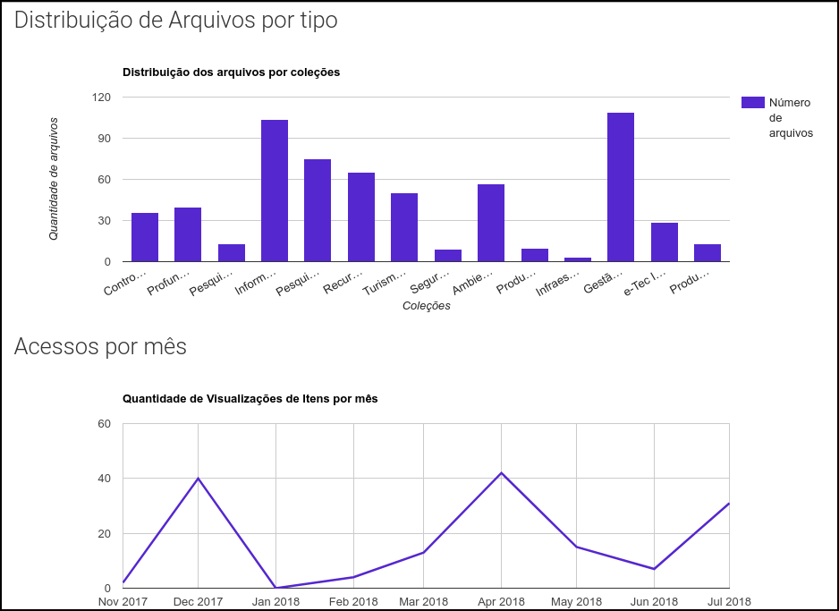

# Estatísticas

Com o objetivo de uma melhor experiência de usuário, o Proedu conta com uma [área de estatísticas](http://proedu.rnp.br/statistics), a fim de apresentar, através de gráficos, o uso da ferramenta.

Inicialmente são apresentados gráficos relacionados ao uso do sistema, sendo eles: _total de itens armazenados_, _quantidade de autores_ e _número de visitas_. 

Para entender como os CDD estão espalhados pelo repositório, são utilizados gráficos com as informações sobre os itens, em que é possível observar a quantidade de cada tipo de item armazenado, e ver as diferentes categorias cadastradas.

 A página de estatísticas dispõe de um _Top 10_ com os itens mais visualizados do repositório. Nele é possível observar quais tipos de objetos são mais procurados dentro do Proedu.

Além disso, também é possível visualizar as palavras mais pesquisadas no Proedu, estando essas distribuídas em uma _word cloud_.

Outra estatística interessante no repositório é a distribuição geográfica dos acessos aos objetos educacionais. 

