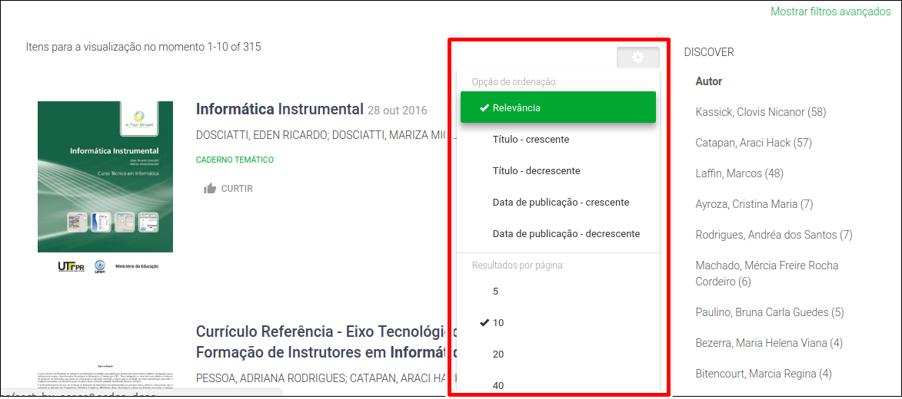

# Pesquisa

No repositório Proedu é possível encontrar centenas de CDD, com diferentes naturezas de mídias, e diversas áreas de conhecimento. Para facilitar o encontro do material desejado, o repositório conta com um robusto sistema de pesquisa que permite a realização de [buscas avançadas](http://proedu.rnp.br/discover). Para facilitar o encontro dos itens, o repositório possui uma barra de pesquisa na margem superior da página, como pode ser visto na imagem à seguir:

A pesquisa pode procurar por todos os tipos de CDD, ou por um tipo específico de conteúdo. Para isso, basta escolher uma opção na barra de seleção: 

O sistema de pesquisa do repositório também possui a opção de filtros, o que permite realizar uma busca em campos específicos dos itens armazenados, tais como: autor, assunto e data de publicação. Para acessá-lo basta clicar em _Mostrar filtros avançados._

Além disso, é possível configurar a forma como o resultado da pesquisa é apresentado na tela, podendo ser alterado a _opção de ordenação_ e a quantidade de itens por tela.

